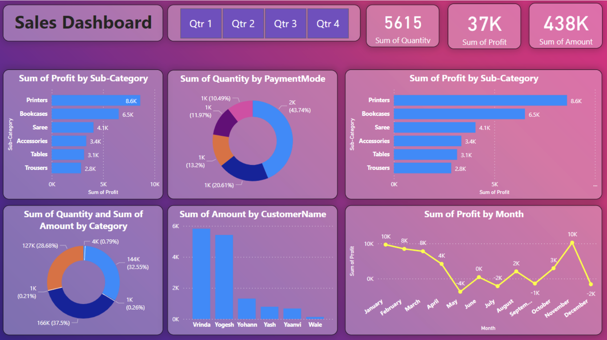

# Customer Churn Analysis Dashboard

Interactive Power BI dashboard focused on customer churn analysis, retention trends, and operational insights.

## Features
- Customer churn tracking
- KPI monitoring
- Retention trend analysis
- Customer segmentation
- Interactive visualizations

## Tools Used
- Power BI
- Excel / CSV
- Data Analytics
- Business Intelligence

## Objectives
- Identify customer churn patterns
- Analyze retention metrics
- Improve business visibility
- Support data-driven decisions

## Dashboard Preview

